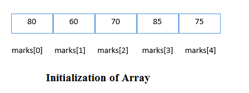
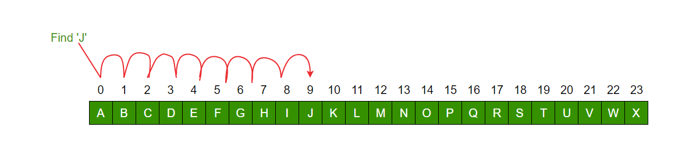

# Array

## Introduction
---------------------------
An array is defined as the collection of similar type of data items stored at contiguous memory locations. Arrays are the derived data type in C programming language which can store the primitive type of data such as ``int``, ``char``, ``double``, ``float``, etc. It also has the capability to store the collection of derived data types, such as ``pointers``, ``structure``, etc. The array is the simplest data structure where each data element can be randomly accessed by using its index number.

C array is beneficial if you have to store similar elements. For example, if we want to store the marks of a student in 6 subjects, then we don't need to define different variables for the marks in the different subject. Instead of that, we can define an array which can store the marks in each subject at the contiguous memory locations.

By using the array, we can access the elements easily. Only a few lines of code are required to access the elements of the array.

Advantages of an Array in C: 

* Random access of elements using array index.
* Use of less line of code as it creates a single array of multiple elements.
* Easy access to all the elements.
* Traversal through the array becomes easy using a single loop.
* Sorting becomes easy as it can be accomplished by writing less line of code.

Disadvantages of an Array in C: 

* Allows a fixed number of elements to be entered which is decided at the time of declaration. Unlike a linked list, an array in C is not dynamic.
* Insertion and deletion of elements can be costly since the elements are needed to be managed in accordance with the new memory allocation.

## Declaration
----------------------------
We can declare an array in the c language in the following way:

```c
data_type array_name[array_size];  
```
Now, let us see the example to declare the array.

```c
int marks[5];  
```
Here, ``int`` is the ``data_type``, ``marks`` are the ``array_name``, and ``5`` is the ``array_size``.

## Initialization
-----------------------------
The simplest way to initialize an array is by using the index of each element. We can initialize each element of the array by using the index. Consider the following example.

```c
marks[0]=80;//initialization of array  
marks[1]=60;  
marks[2]=70;  
marks[3]=85;  
marks[4]=75;  
```


## Types of Array
--------------------------
In c programming language, arrays are classified into two types. They are as follows:

* Single Dimensional Array / One Dimensional Array
* Multi Dimensional Array

### **One Dimensional Array**
_In c programming language, single dimensional arrays are used to store list of values of same datatype. In other words, single dimensional arrays are used to store a row of values. In single dimensional array, data is stored in linear form. Single dimensional arrays are also called as one-dimensional arrays, Linear Arrays or simply 1-D Arrays._

Declaration:

```c
data_type array_name[array_size];  
```
```c
int num[5];  
```
### **Multi Dimensional Array**
_An array of arrays is called as multi dimensional array. In simple words, an array created with more than one dimension (size) is called as multi dimensional array. Multi dimensional array can be of two dimensional array or three dimensional array or four dimensional array or more..._

_Most popular and commonly used multi dimensional array is two dimensional array. The 2-D arrays are used to store data in the form of table. We also use 2-D arrays to create mathematical matrices._

_The two-dimensional array can be defined as an array of arrays. The 2D array is organized as matrices which can be represented as the collection of rows and columns. However, 2D arrays are created to implement a relational database lookalike data structure. It provides ease of holding the bulk of data at once which can be passed to any number of functions wherever required._

The syntax to declare the 2D array is given below:

```c
data_type array_name[rows][columns];  
```
Consider the following example:
```c
int twodimen[4][3];  
```
Here, ``4`` is the number of ``rows``, and ``3`` is the number of ``columns``.

## Searching
-------------------------------
Searching Algorithms are designed to check for an element or retrieve an element from any data structure where it is stored. 

### **Sequential Search/Linear Search:**
_Linear or sequential search algorithm is a method for finding a target value within a list._

_It sequentially checks each element of the list for the target value until a match is found or until all the elements have been searched._

_In this, the list or array is traversed sequentially and every element is checked._



Example:

```c
#include <stdio.h>
#include <conio.h>
void linearsearch(const int *arr,int n,int key)
{
	// This function performs linear search on given array.
    int i, found=0;
    printf("*********[SEARCH RESULT]*********\n");
    for(i=0;i<n;i++)
    {
        if(arr[i]==key)
        {
           printf("Found %d at index %d\n",key,i);
           found++;
        }
    }
    if(found==0)
    {
    	printf("Not found\n\n");
    }
    else
    {
	printf("%d is present %d times in the array.\n\n",key,found);
    }
}
int main()
{
    int n=9;//Number of element in the array.
    int arr[]={5,4,7,3,78,8,5,7,5};
    int key=5;//Key to search in the array.
    linearsearch(arr,n,key);
    getch();
    return(0);
}

```
## Sorting
-------------------------------
A Sorting Algorithm is used to rearrange a given array or list elements according to a comparison operator on the elements. The comparison operator is used to decide the new order of element in the respective data structure.

### **Bubble Sort**

_Bubble Sort is the simplest sorting algorithm that works by repeatedly swapping the adjacent elements if they are in wrong order._

Example:

**First Pass:**

( ``5`` ``1`` 4 2 8 ) –> ( ``1`` ``5`` 4 2 8 ), _Here, algorithm compares the first two elements, and swaps since 5 > 1._

( 1 ``5`` ``4`` 2 8 ) –>  ( 1 ``4`` ``5`` 2 8 ), _Swap since 5 > 4_

( 1 4 ``5`` ``2`` 8 ) –>  ( 1 4 ``2`` ``5`` 8 ), _Swap since 5 > 2_

( 1 4 2 ``5`` ``8`` ) –> ( 1 4 2 ``5`` ``8`` ), _Now, since these elements are already in order (8 > 5), algorithm does not swap them._

**Second Pass:**

( ``1`` ``4`` 2 5 8 ) –> ( ``1`` ``4`` 2 5 8 )

( 1 ``4`` ``2`` 5 8 ) –> ( 1 ``2`` ``4`` 5 8 ), _Swap since 4 > 2_

( 1 2 ``4`` ``5`` 8 ) –> ( 1 2 ``4`` ``5`` 8 )

( 1 2 4 ``5`` ``8`` ) –>  ( 1 2 4 ``5`` ``8`` )_Now, the array is already sorted, but our algorithm does not know if it is completed. The algorithm needs one whole pass without any swap to know it is sorted._

**Third Pass:**

( ``1`` ``2`` 4 5 8 ) –> ( ``1`` ``2`` 4 5 8 )

( 1 ``2`` ``4`` 5 8 ) –> ( 1 ``2`` ``4`` 5 8 )

( 1 2 ``4`` ``5`` 8 ) –> ( 1 2 ``4`` ``5`` 8 )

( 1 2 4 ``5`` ``8`` ) –> ( 1 2 4 ``5`` ``8`` )

Example:
```c
#include <stdio.h>
#include <conio.h>
int main()
{
    int i, j, temp, arr[10];
    printf("Enter any 10 number:\n");
    for (i = 0; i < 10; i++)
    {
        printf("Index [%d] :", i);
        scanf("%d", &arr[i]);
    }
    for (i = 0; i < 10; i++)
    {
        for (j = i + 1; j < 10; j++)
        {
            if (arr[i] > arr[j])
            {
                temp = arr[i];
                arr[i] = arr[j];
                arr[j] = temp;
            }
        }
    }
    printf("******After Shorting******\n");
    for (i = 0; i < 10; i++)
    {
        printf("Index [%d] :%d \n", i, arr[i]);
    }
    getch();
    return (0);
}
```
## String Handeling
---------------------------
Strings are defined as an array of characters. The difference between a character array and a string is the string is terminated with a special character ``\0``.

You need to often manipulate strings according to the need of a problem. Most, if not all, of the time string manipulation can be done manually but, this makes programming complex and large.

To solve this, C supports a large number of string handling functions in the standard library ``string.h``.

### **Declaration of strings:**
_Declaring a string is as simple as declaring a one-dimensional array. Below is the basic syntax for declaring a string._

```c
char str_name[size];
```
_In the above syntax ``str_name`` is any name given to the string variable and ``size`` is used to define the length of the string, i.e the number of characters strings will store. Please keep in mind that there is an extra terminating character which is the Null character (‘\0’) used to indicate the termination of string which differs strings from normal character arrays._

### **Initializing a String:**
_A string can be initialized in different ways. We will explain this with the help of an example. Below is an example to declare a string with name as str and initialize it with_

```C 
char str[20] = {‘s’,‘t’,‘u’,‘d’,‘y’, ‘\0’};
 
char str[20] = “demo”;

char str[] = “demo”;
```

_Few commonly used string handling functions are discussed below:_

|  Function  |       Work of Function         |
|------------|--------------------------------|
|``strlen()``| computes string's length       |
|``strcpy()``| copies a string to another     |
|``strcat()``| concatenates(joins) two strings|
|``strcmp()``| compares two strings           |
|``strlwr()``| converts string to lowercase   |
|``strupr()``| converts string to uppercase   |
